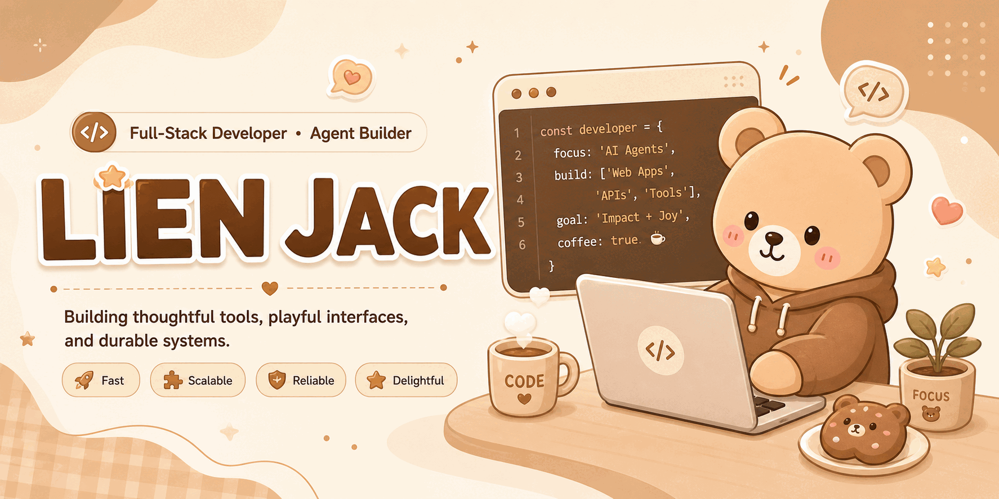
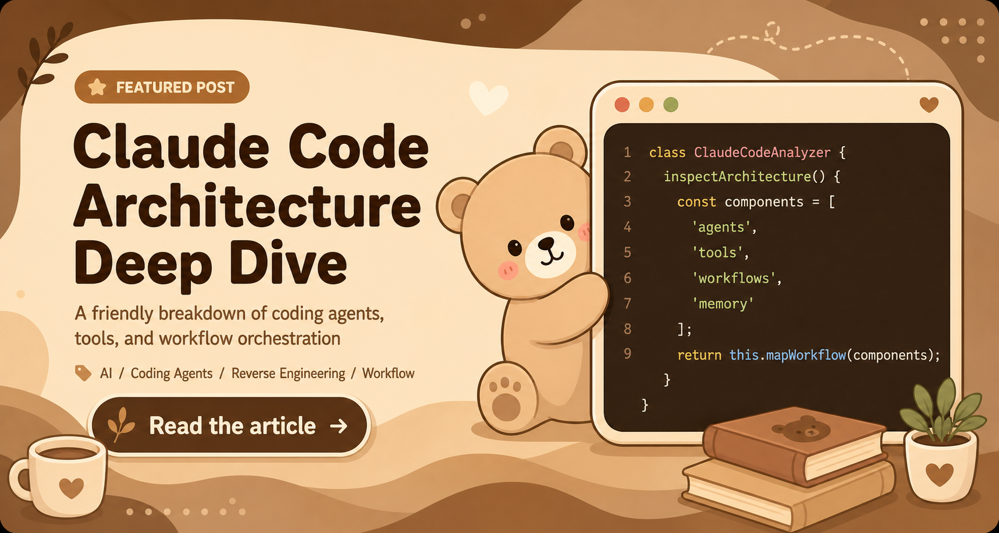

# Hi there, I'm Lien Jack

  

  

    <a href="./README.md">English</a> · <a href="./README_ZH.md">简体中文</a> · <a href="./README_JA.md"><strong>日本語</strong></a>
  

  <h3>東京を拠点にリモートで働くフルスタックエンジニア / Agent Builder</h3>
  
元 NetEase / ByteDance / Ethereum Community Fund。Lark、CapCut、軽颜などのプロダクト開発に携わってきました

  
Agent をつくり、システムを整え、プロダクトに少しだけアニメっぽいときめきを添えるのが好きです。

  

    
    
    
    
  

  

    
    
    
    
  

---

## 自己紹介

- NetEase、ByteDance、Ethereum Community Fund でエンジニアとして、大規模ユーザー向けのプロダクト開発に携わってきました。
- `Lark`、`CapCut`、`軽颜` などのプロジェクトに参加し、要件整理から設計、実装まで一通り対応できます。
- 現在は東京でリモート勤務をしながら、`Agent` 関連開発、フロントエンド体験、バックエンド設計、開発効率、AI ネイティブなワークフローに注力しています。
- 使い心地がよく、保守しやすく、細部に少し個性が宿るプロダクトが好きです。

## 注目記事

Coding Agent やツール呼び出し、ワークフロー設計に興味がある方には、特にこの一本をおすすめします。

  

  <a href="https://blog.lienjack.com/blog/AI/3.ClaudeCode%E6%BA%90%E7%A0%81%E8%A7%A3%E6%9E%90"><strong>記事を読む</strong></a>
  ·
  <a href="https://blog.lienjack.com/">ブログへ</a>

## Capability Map

  できることを全部並べるのではなく、普段の開発で一番よく横断している 3 つのレーンを見せています。

 

<table>
  <tr>
    <td width="33%" valign="top">
      <h3>Frontend Craft</h3>
      
プロダクトの見え方、触り心地、そして保守しやすい UI 設計。

      

        
      

      

        
        
        
      

    </td>
    <td width="33%" valign="top">
      <h3>Backend Logic</h3>
      
API、Agent workflow、そして素早い改善を支えるサービス設計。

      

        
      

      

        
        
        
      

    </td>
    <td width="33%" valign="top">
      <h3>Data & Infra</h3>
      
ストレージ、キャッシュ、コンテナ、そして安定運用のための土台づくり。

      

        
      

      

        
        
        
      

    </td>
  </tr>
</table>

  普段はこの 3 つを分業前提で切り分けるより、まとめてつなぎながら作ることが多いです。

## 今、注力していること

- Agent 関連開発とワークフロー設計
- 使いやすく、気持ちよく触れるプロダクト体験づくり
- 安定して拡張しやすいフロントエンド / バックエンド設計
- 開発効率と開発者体験の改善
- 実践的な AI ネイティブ開発フローの探求
