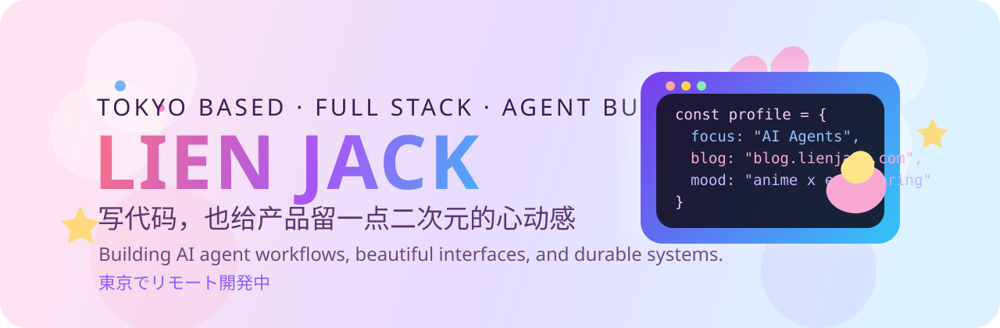
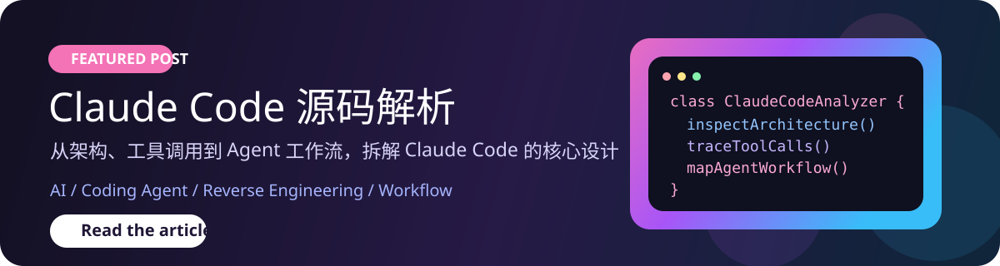

# Hi there, I'm Lien Jack

  

  

    <a href="./README.md">English</a> · <a href="./README_ZH.md"><strong>简体中文</strong></a> · <a href="./README_JA.md">日本語</a>
  

  

  <h3>在东京远程工作的全栈开发者 / Agent Builder</h3>
  
前网易 / 字节跳动 / Ethereum Community Fund，参与过 Lark、CapCut、轻颜等产品的工程建设

  
做 Agent，做系统，也喜欢给产品留一点二次元的心动感。

  

    
    
    
    
  

  

    
    
    
    
  

---

## 关于我

- 曾在网易、字节跳动和 Ethereum Community Fund 做工程研发，参与过面向大规模用户的产品建设。
- 参与过 `Lark`、`CapCut`、`轻颜` 等项目，比较熟悉从需求理解、方案设计到工程落地的完整链路。
- 目前在东京远程工作，正在做 `Agent` 相关开发，也长期关注 `前端体验`、`后端架构`、`工程效率` 和 `AI 原生工作流`。
- 我喜欢把产品做顺，把系统做稳，也愿意给界面保留一点轻盈、可爱的表达。

## 置顶文章

如果你也对 Coding Agent、工具调用和工作流设计感兴趣，这篇我很推荐：

  

  <a href="https://blog.lienjack.com/blog/AI/3.ClaudeCode%E6%BA%90%E7%A0%81%E8%A7%A3%E6%9E%90"><strong>阅读全文</strong></a>
  ·
  <a href="https://blog.lienjack.com/">访问博客</a>

## 技能树

> 按你现在给的信息，先收成一版更贴近真实的技术画像。

### 前端

  

`TypeScript` / `JavaScript` / `React` / `Next.js` / `Vue` / `NestJS`

### 后端

  

`Node.js` / `Go` / `NestJS`

### 数据库 / 基础设施

  

`MySQL` / `PostgreSQL` / `Redis` / `MongoDB` / `Docker`

## GitHub 数据面板

  

  
  

  

## 当前关注

- Agent 相关开发与工作流设计
- 打磨体验顺滑、表达清晰的产品界面
- 设计稳定、清晰、可扩展的前后端系统
- 提升团队工程效率与开发者体验
- 探索 AI 在真实研发流程里的落地方式

## 提交轨迹

  

